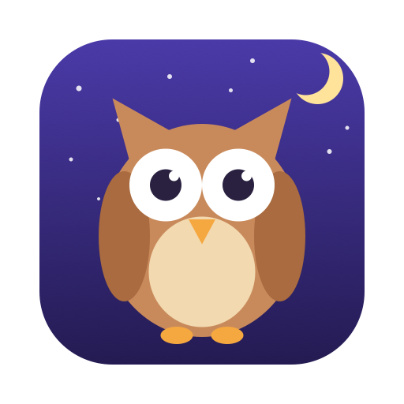

<p align="center">
  
</p>

<h1 align="center">Hoot</h1>

<p align="center"><b>The night owl for your menu bar — keeps your Mac wide awake.</b></p>

<p align="center">
  <a href="https://github.com/jimmymarsanico/hoot/releases/latest"></a>
  
  <a href="https://github.com/jimmymarsanico/hoot/actions/workflows/ci.yml"></a>
  
</p>

Hoot is a tiny macOS menu bar app that stops your Mac from going to sleep — for five minutes, for four hours, until an app finishes running, or until you say otherwise. It's a friendly face on macOS's built-in [`caffeinate`](https://ss64.com/mac/caffeinate.html) command: no daemons, no kernel extensions, nothing running that Apple didn't ship.

The owl in your menu bar tells you everything at a glance: **eyes open, your Mac stays awake. Eyes closed, normal sleep rules apply.**

## Features

- ☕ **One click to stay awake** — toggle keep-awake indefinitely from the menu bar
- ⏱ **Timed sessions** — 5, 15, or 30 minutes; 1, 2, 3, 4, 8, or 12 hours — with a live countdown in the menu
- 🏃 **"While an app is running"** — pick any running app and Hoot keeps your Mac awake until that app quits (great for long builds, exports, and downloads)
- ⌨️ **Global keyboard shortcut** — record any shortcut to toggle keep-awake from anywhere
- 🖥 **Display control** — keep the screen on too, or let the display sleep while the system stays awake
- 🚀 **Launch at login** — optional, off by default
- 🪶 **Featherweight** — no Dock icon, no background services; quit Hoot and everything returns to normal instantly

## Install

1. Download the latest `Hoot-x.y.z.dmg` from the [releases page](https://github.com/jimmymarsanico/hoot/releases/latest).
2. Open the DMG and drag **Hoot** into **Applications**.
3. Launch Hoot. The owl appears in your menu bar.

### "Hoot can't be opened" on first launch?

Hoot is open source and isn't notarized by Apple (that requires a paid developer subscription), so macOS may warn you the first time. Two ways to proceed:

- Open **System Settings → Privacy & Security**, scroll down, and click **Open Anyway**, _or_
- Clear the quarantine flag from Terminal:

  ```sh
  xattr -cr /Applications/Hoot.app
  ```

You only need to do this once. If you'd rather not trust a downloaded binary at all, [build it from source](#build-from-source) in about a minute.

## Usage

Click the owl and pick a mode:

| Menu item | What it does |
|---|---|
| **Keep Awake** | Keeps your Mac awake until you turn it off |
| **Keep Awake For →** | Keeps your Mac awake for a fixed duration, with a live countdown |
| **While an App Is Running →** | Keeps your Mac awake until the selected app quits |
| **Let My Mac Sleep** | Back to normal — appears whenever Hoot is active |

The first line of the menu always shows what Hoot is doing right now (e.g. *"Awake — 1:23:45 left"*).

### Settings

**Settings…** in the menu opens a small window where you can:

- **Record a global keyboard shortcut** that toggles keep-awake from any app
- **Keep the display awake too** (on by default) — turn it off and your screen can sleep while the system stays up
- **Launch Hoot at login**

## How it works

Hoot runs Apple's own `caffeinate` utility as a child process — `-i` prevents idle system sleep, `-d` additionally keeps the display awake. Every session is pinned to a watched process with `-w`, so the sleep assertion can never outlive its purpose: when the watched app quits, the timer ends, or Hoot itself exits (even ungracefully), your normal energy settings take over again.

Closing your MacBook's lid still sleeps it — like `caffeinate` itself, Hoot prevents *idle* sleep, not lid sleep.

## Build from source

Requires macOS 13+ and the Xcode Command Line Tools (`xcode-select --install`).

```sh
git clone https://github.com/jimmymarsanico/hoot.git
cd hoot
./Scripts/build_app.sh     # → build/Hoot.app
./Scripts/package_dmg.sh   # → dist/Hoot-x.y.z.dmg (optional)
```

Then move `build/Hoot.app` into `/Applications`. The app icon and logo are generated from code, too: `swift Scripts/make_icon.swift`.

## License

[MIT](LICENSE) © Jimmy Marsanico
